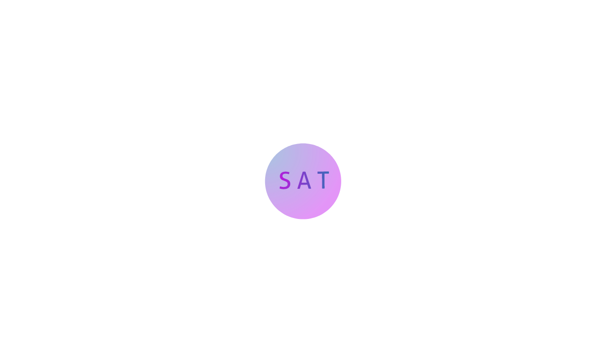

<div align="center">
   </img>
</div>

<div align="center">
   <h1>Sky AI Trainer</h1>
   <p>简陋的AI训练程序，打造自己的AI模型🚀</p>
</div>

简体中文|[English](./README_en.md)

## 功能

√ 训练AI模型(核心功能)

√ 重复训练

√ 在线对话测试

√ 数据集训练

√ 联网训练(有点鸡肋)

√ 保存模型(这个列出来没必要)

## 安装和使用

### 1.安装Python

```

请自己解决

```

### 2.安装需要的库

```
pip install torch torchvision torchaudio
```

```
pip install scikit-learn
```

```
pip install numpy
```

```
pip install requests
```

```
pip install beautifulsoup4
```

### 3.下载代码，在 skyaitrainer 文件夹里找到skyaitrainer..py程序运行即可

## 贡献

欢迎各位大佬提出建议或贡献代码!!!

## 开源许可

MIT